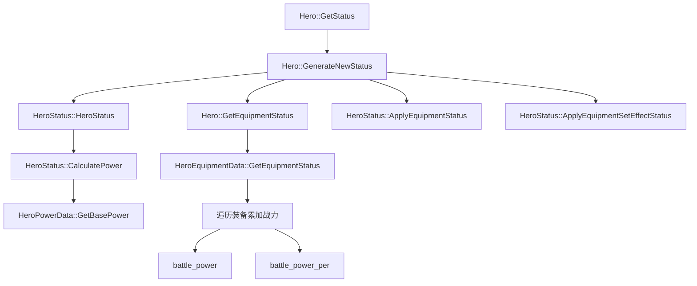

# Eversoul 战力计算系统完整解析

## 📋 目录

1. [概述](#概述)
2. [战力计算流程](#战力计算流程)
3. [基础战力计算](#基础战力计算)
4. [角色属性计算](#角色属性计算)
5. [装备战力计算](#装备战力计算)
6. [完整战力公式](#完整战力公式)

---

## 📖 概述

Eversoul 的战力系统由以下几个部分组成：

- **基础战力**：由角色等级和实体类型决定
- **等级加成战力**：好感度等系统提供的等级加成
- **阶级加成战力**：觉醒阶数提供的品质加成
- **装备战力**：装备的固定战力和百分比战力
- **遗物战力**：签名武器提供的百分比战力
- **内容增益战力**：方舟、星座、建筑、潜能等系统的战力加成

---

## 🔄 战力计算流程

### 函数调用关系图



### 核心函数说明

| 函数名                       | 作用             | 对应游戏逻辑             |
| ---------------------------- | ---------------- | ------------------------ |
| `GetBasePower()`           | 计算角色基础战力 | 等级相关的基础战力       |
| `HeroStatus::HeroStatus()` | 初始化角色状态   | 计算角色属性（攻防血等） |
| `CalculatePower()`         | 计算最终战力     | 整合所有战力来源         |
| `GetEquipmentStatus()`     | 获取装备状态     | 累加装备战力和属性       |
| `ApplyEquipmentStatus()`   | 应用装备战力     | 将装备战力加到总战力     |

---

## ⚡ 基础战力计算

### 公式

```python
base_power = base + (level_coef + level_per_coef × level) × (level - 1)
```

### 代码实现

```c
int32_t GetBasePower(int32_t powerType, int32_t level)
{
    float base, levelCoef, levelPerCoef;
  
    // 根据实体类型选择系数
    switch(powerType) {
        case 1:  // 角色
            base = powerHeroBase;
            levelCoef = powerHeroLevel;
            levelPerCoef = powerHeroLevelPer;
            break;
        case 2:  // 怪物
            base = powerMonsterBase;
            levelCoef = powerMonsterLevel;
            levelPerCoef = powerMonsterLevelPer;
            break;
        case 3:  // 恶灵/Boss
            base = powerRaidBase;
            levelCoef = powerRaidLevel;
            levelPerCoef = powerRaidLevelPer;
            break;
    }
  
    return (int)(base + (levelCoef + levelPerCoef * level) * (level - 1));
}
```

---

## 🎭 角色属性计算

### 关键系数

| 系数名称     | 变量名             | 说明                                      |
| ------------ | ------------------ | ----------------------------------------- |
| 阶级系数     | `gradeValue`     | 觉醒阶数的品质加成，向上取整到小数点后2位 |
| 等级加成率   | `levelBonusRate` | 好感度等系统提供的加成                    |
| 等级加成基数 | `level - 1`      | 等级提升带来的属性增长                    |

### 属性计算公式

#### 1. 攻击力/防御力/体力

```python
# 攻击力
final_attack = gradeValue × (base_attack + inc_attack × (level - 1)) × levelBonusRate
attack = int(final_attack)

# 防御力（同攻击力）
final_defence = gradeValue × (base_defence + inc_defence × (level - 1)) × levelBonusRate
defence = int(final_defence)

# 体力（同上）
final_hp = gradeValue × (base_hp + inc_hp × (level - 1)) × levelBonusRate
hp = int(final_hp)
```

#### 2. 暴击率/暴击威力（百分比属性）

```python
# 不受 gradeValue 影响
critical_rate = base_critical_rate + inc_critical_rate × (level - 1)
critical_power = base_critical_power + inc_critical_power × (level - 1)
```

#### 3. 命中/闪避

```python
# 转换为整数
hit = int(base_hit + inc_hit × (level - 1))
dodge = int(base_dodge + inc_dodge × (level - 1))
```

#### 4. 固定属性

```python
# 不受等级影响
magic_resist = hero.MagicResist
physical_resist = hero.PhysicalResist
life_leech = hero.LifeLeech
attack_speed = 1.0  # 默认值
```

### 代码示例

```c
// HeroStatus::HeroStatus() 初始化函数片段

// 1. 获取阶级系数（向上取整）
float gradeValue = ceil(heroGradeValue * 100.0) / 100.0;

// 2. 计算攻击力
int attack_base = hero.Attack;
int attack_inc = hero.IncAttack;
int level_bonus = level - 1;

double final_attack = gradeValue * (attack_base + attack_inc * level_bonus) * levelBonusRate;
status[Status.Attack] = (int)final_attack;

// 3. 计算暴击率
float critical_rate = hero.CriticalRate + hero.IncCriticalRate * level_bonus;
status[Status.CriticalRate] = critical_rate;
```

---

## 🎒 装备战力计算

### 关键函数：`GetEquipmentStatus`

此函数遍历所有装备，累加战力和属性。

```c
void GetEquipmentStatus(
    IList<EquippedItem> equipmentList,
    SignatureWeaponInfo signature,
    int *equipPower,          // 输出：装备固定战力
    float *equipPowerPer,     // 输出：装备战力百分比
    float *signaturePower     // 输出：遗物战力百分比
)
{
    *equipPower = 0;
    *equipPowerPer = 0.0f;
    *signaturePower = 0.0f;
  
    // 遍历所有装备
    for each item in equipmentList:
        ItemStat stat = GetItemStat(item.no, item.level);
      
        // ⭐ 关键1: 累加固定战力
        *equipPower += stat.battle_power;
      
        // ⭐ 关键2: 累加战力百分比
        *equipPowerPer += stat.battle_power_per;
      
        // 累加装备属性（影响角色面板）
        AddListConst(Status.Attack, stat.attack);
        AddListConst(Status.Defence, stat.defence);
        AddListRate(Status.Attack, stat.attack_rate);
        AddListRate(Status.Defence, stat.defence_rate);
        AddListRate(Status.HP, stat.hp_rate);
        // ... 其他属性
  
    // 处理遗物
    if (signature != null):
        *signaturePower = signature.BattlePower;
}
```

## 🎯 完整战力公式

### 最终公式

```python
totalPower = basePower                              # 基础战力
           + (levelBonusRate - 1.0) × basePower     # 等级加成战力
           + (gradeValue - 1.0) × basePower         # 阶级加成战力
           + equipPower                             # 装备固定战力（直接累加）
           + equipPowerPer × basePower              # 装备百分比战力（⚠️ 乘以基础战力）
           + signaturePower × basePower             # 遗物百分比战力（⚠️ 乘以基础战力）
           + contentsBuffPower                      # 内容增益固定战力
           + contentsBuffPowerPer × basePower       # 内容增益百分比战力
```

### 战力组成表

| 战力组成       | 计算方式                                      | 加成对象           | 说明         |
| -------------- | --------------------------------------------- | ------------------ | ------------ |
| 基础战力       | `base + (coef + per × level) × (level-1)` | -                  | 等级决定     |
| 等级加成       | `(levelBonusRate - 1) × basePower`         | 基础战力           | 好感度等     |
| 阶级加成       | `(gradeValue - 1) × basePower`             | 基础战力           | 觉醒阶数     |
| 装备固定战力   | `Σ(装备.battle_power)`                     | -                  | 直接累加     |
| 装备百分比战力 | `Σ(装备.battle_power_per) × basePower`    | **基础战力** | 关键点       |
| 遗物百分比战力 | `签名武器.battle_power × basePower`        | **基础战力** | 最高级生效   |
| 内容增益战力   | `Σ(增益.power)`                            | -                  | 方舟、链接等 |
| 内容增益百分比 | `Σ(增益.power_per) × basePower`           | **基础战力** | 星座、建筑等 |

---
